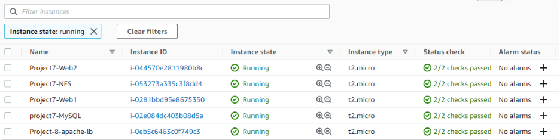
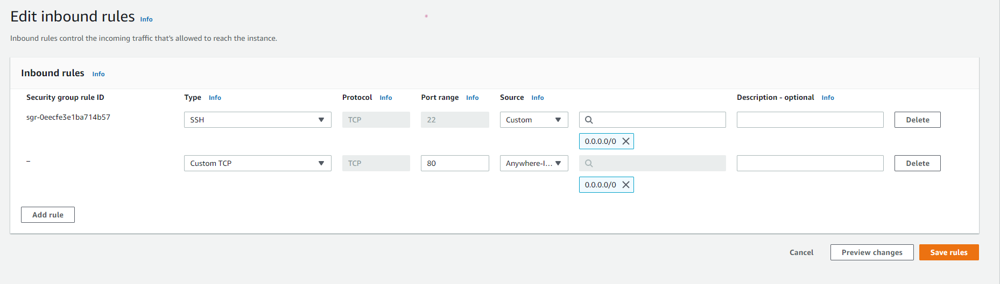

We are deploying and configuring an Apache Load Balancer for Tooling Website solution on a separate Ubuntu EC2 instance. Make sure that users can be served by Web servers through the Load Balancer.
To simplify, let us implement this solution with 2 Web Servers, the approach will be the same for 3 and more Web Servers.

## Prerequisites
Make sure that you have the following servers installed and configured within Project-7(Devops-Tooling-Websites)
- Two RHEL8 Web Servers
- One MySQL DB Server (based on Ubuntu 20.04)
- One RHEL8 NFS server

## STEP 1-CONFIGURE APACHE AS A LOAD BALANCER
1. Configure Apache As A Load Balancer
Create an Ubuntu Server 20.04 EC2 instance and name it Project-8-apache-lb, so your EC2 list will look like this:



2.Open TCP port 80 on Project-8-apache-lb by creating an Inbound Rule in the Security Group.



Install Apache Load Balancer on Project-8-apache-lb server and configure it to point traffic coming to LB to both Web Servers:

```
#Install apache2
sudo apt update
sudo apt install apache2 -y
sudo apt-get install libxml2-dev


#Enable the following modules:
sudo a2enmod rewrite
sudo a2enmod proxy
sudo a2enmod proxy_balancer
sudo a2enmod proxy_http
sudo a2enmod headers
sudo a2enmod lbmethod_bytraffic


#Restart apache2 service
sudo systemctl restart apache2
```
3. Make sure apache2 is up and running

`sudo systemctl status apache2`

4. Configure load balancing

`sudo vi /etc/apache2/sites-available/000-default.conf`
ii
