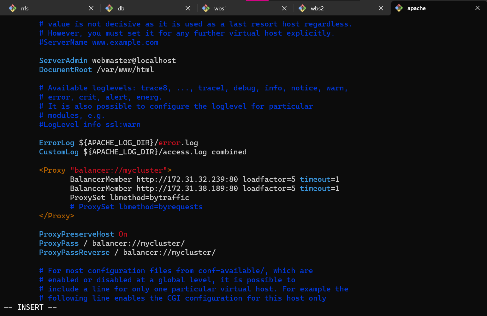
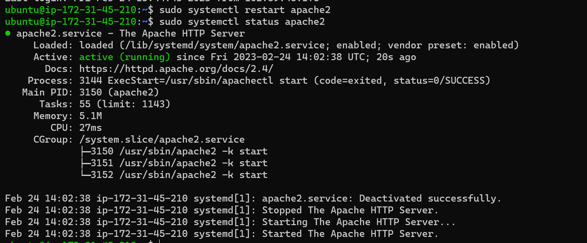
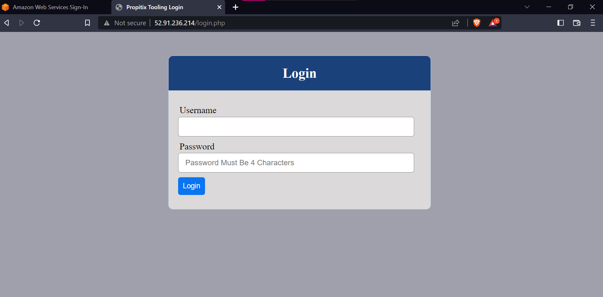
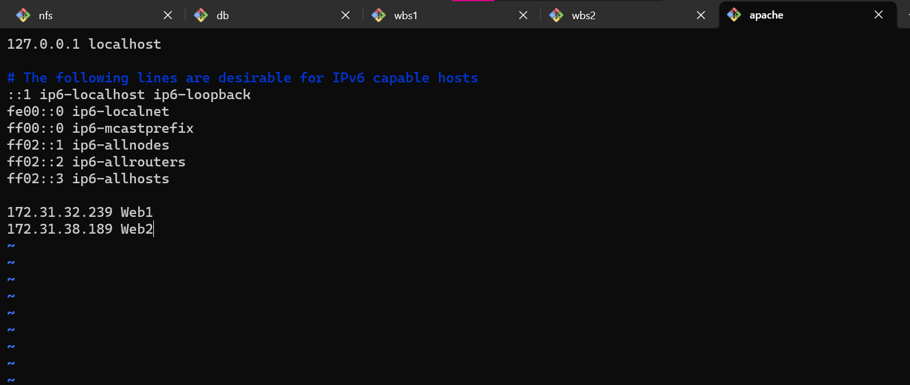
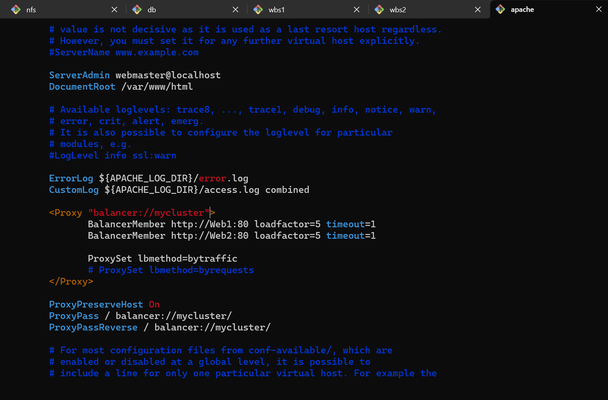
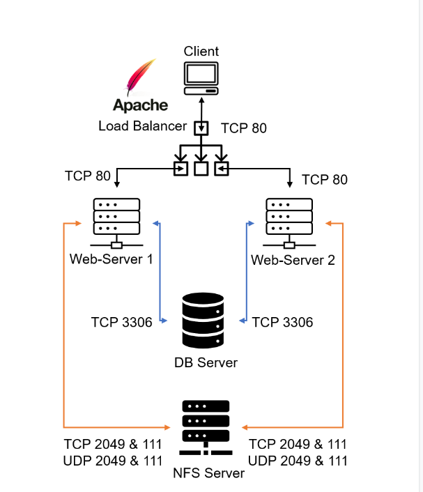

We are deploying and configuring an Apache Load Balancer for Tooling Website solution on a separate Ubuntu EC2 instance. Make sure that users can be served by Web servers through the Load Balancer.
To simplify, let us implement this solution with 2 Web Servers, the approach will be the same for 3 and more Web Servers.

## Prerequisites
Make sure that you have the following servers installed and configured within Project-7(Devops-Tooling-Websites)
- Two RHEL8 Web Servers
- One MySQL DB Server (based on Ubuntu 20.04)
- One RHEL8 NFS server

## STEP 1-CONFIGURE APACHE AS A LOAD BALANCER
1. Configure Apache As A Load Balancer
Create an Ubuntu Server 20.04 EC2 instance and name it Project-8-apache-lb, so your EC2 list will look like this:


2.Open TCP port 80 on Project-8-apache-lb by creating an Inbound Rule in the Security Group.


Install Apache Load Balancer on Project-8-apache-lb server and configure it to point traffic coming to LB to both Web Servers:

```
#Install apache2
sudo apt update.
sudo apt install apache2 -y
sudo apt-get install libxml2-dev


#Enable the following modules:
sudo a2enmod rewrite
sudo a2enmod proxy
sudo a2enmod proxy_balancer
sudo a2enmod proxy_http
sudo a2enmod headers
sudo a2enmod lbmethod_bytraffic


#Restart apache2 service
sudo systemctl restart apache2
```
3. Make sure apache2 is up and running

`sudo systemctl status apache2`

4. Configure load balancing

`sudo vi /etc/apache2/sites-available/000-default.conf`

-  Add this configuration into this section <VirtualHost *:80>  </VirtualHost>
```

<Proxy "balancer://mycluster">
               BalancerMember http://<WebServer1-Private-IP-Address>:80 loadfactor=5 timeout=1
               BalancerMember http://<WebServer2-Private-IP-Address>:80 loadfactor=5 timeout=1
               ProxySet lbmethod=bytraffic
               # ProxySet lbmethod=byrequests
        </Proxy>


        ProxyPreserveHost On
        ProxyPass / balancer://mycluster/
        ProxyPassReverse / balancer://mycluster/
```


- Restart apache server
  
  `sudo systemctl restart apache2`



>**bytraffic** balancing method will distribute the incoming load between your Web Servers according to the current traffic load. We can control in which proportion the traffic must be distributed by **loadfactor** parameter.

5. Verify that our configuration works – try to access your LB’s public IP address or Public DNS name from your browser:
   
   <http://Load-Balancer-Public-IP-Address-or-Public-DNS-Name/index.php>



>Note: If in Project-7 you mounted */var/log/httpd/* from your Web Servers to the NFS server – unmount them and make sure that each Web Server has its own log directory.

`sudo umount -f /var/www/httpd`

`sudo systemctl restart htttp`

6. Open two ssh/Putty consoles for both Web Servers and run the following command:

`sudo tail -f /var/log/httpd/access_log`

Try to refresh your browser page <http://Load-Balancer-Public-IP-Address-or-Public-DNS-Name/index.php> several times and ensure both servers receive HTTP GET requests from your LB – new records must appear in each server’s log file. The number of requests to each server will be approximately the same since we set loadfactor to the same value for both servers – it means that traffic will be distributed evenly between them.

If you have configured everything correctly – your users will not even notice that their requests are served by more than one server.

### Optional Step – Configure Local DNS Names Resolution
Sometimes it is tedious to remember and switch between IP addresses, especially if you have a lot of servers under your management.
What we can do, is to configure local domain name resolution. The easiest way is to use **/etc/hosts** file, although this approach is not very scalable, it is very easy to configure and shows the concept well. So let us configure the IP address to domain name mapping for our LB.

`sudo vi /etc/hosts`

- Add 2 records into this file with the Local IP address and arbitrary name for both of your Web Servers
```
<WebServer1-Private-IP-Address> Web1
<WebServer2-Private-IP-Address> Web2
```
Like so:



- Now you can update your LB config file with those names instead of IP addresses.
- 
`sudo vi /etc/apache2/sites-available/000-default.conf`



You can try to curl your Web Servers from LB locally 

`curl http://Web1` or 
`curl http://Web2`

It shall work!!

>**Remember**, this is only an internal configuration and it is also local to your LB server, these names will neither be ‘resolvable’ from other servers internally nor from the Internet.

### Now our set-up looks like this:



Congratulations!!!
You have just implemented a Load balancing Web Solution for your DevOps team.
**AWESOME JOB**


